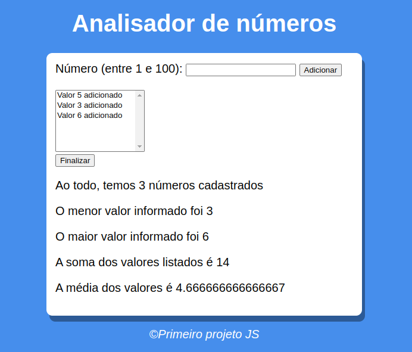

# Analisador de números

## Projeto de estudo JS

### Entradas

- Input aceita apenas números entre 1 e 100

### saídas

- Números listados;
- quantidade de números adicionados;
- número maior e menor;
- média dos números;
- soma dos números 

### tela 

